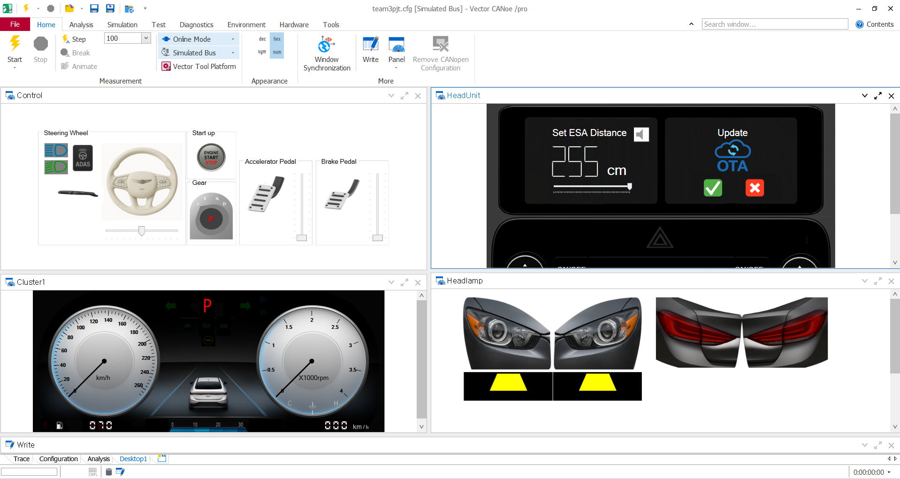
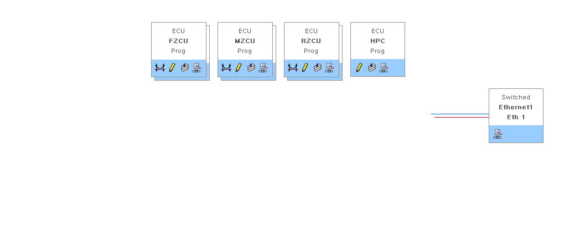
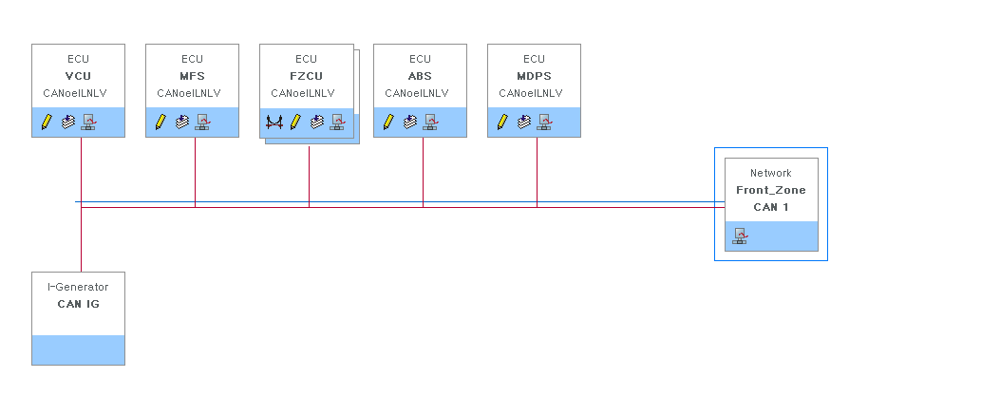
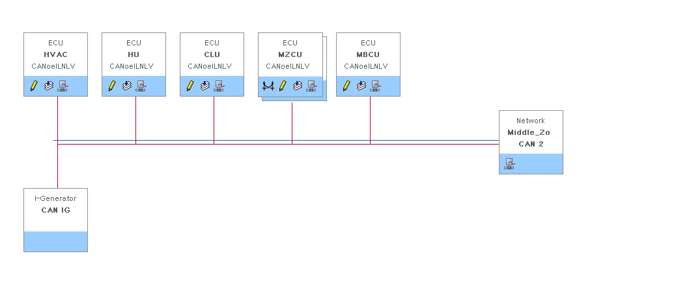
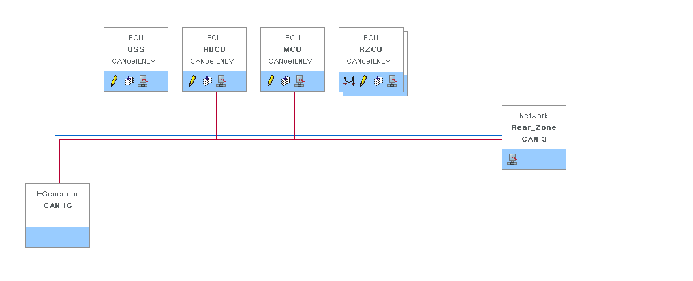
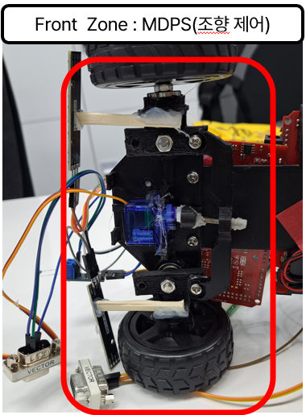
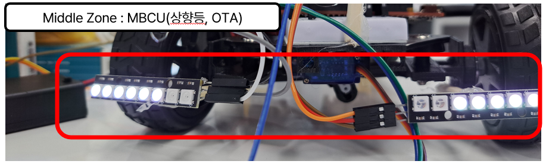
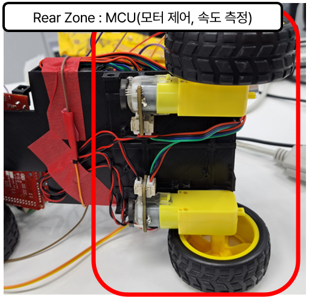

# ADAS 자동 조향 시스템

## 👥 팀원 소개

| 배정우 | 조현호 | 박주현 | 김호준 | 김서진 | 박해웅 |
|:------:|:------:|:------:|:------:|:------:|:------:|
| [@jwjungwoo](https://github.com/jwjungwoo) | [@178kg78cm](https://github.com/178kg78cm) | [@ian125](https://github.com/ian125) | [@kimhojun2](https://github.com/kimhojun2) | [@loltochess](https://github.com/loltochess) | [@seabears](https://github.com/seabears) |

---

## 프로젝트 구조

📦 HPC (상위 통합 제어 ECU)  

├── 📂 Front  
│   ├── Front ZCU (게이트웨이)  
│   │  
│   ├── VCU  
│   │   └── 페달 입력 (가속, 브레이크), 변속기 입력  
│   │  
│   ├── ABS  
│   │   └── 브레이크 제어  
│   │  
│   ├── MDPS  
│   │   └── 스티어링 및 헤드램프 버튼 입력  
│   │  
│   └── MFS  
│       └── 전방 카메라  

├── 📂 Middle  
│   ├── Middle ZCU (게이트웨이)  
│   │  
│   ├── Middle BCU (바디 제어)  
│   │   ├── 헤드램프 제어  
│   │   └── 스피커 제어  
│   │  
│   ├── CLU  
│   │   └── 클러스터 (계기판)  
│   │  
│   ├── HU  
│   │   └── 헤드유닛 (오디오/미디어)  
│   │  
│   └── HVAC  
│       └── 공조 시스템  

├── 📂 Rear  
│   ├── Rear ZCU (게이트웨이)  
│   │  
│   ├── Rear BCU  
│   │   └── 테일 램프 제어  
│   │  
│   ├── USS  
│   │   └── 후방 초음파 센서  
│   │  
│   └── MCU 
│       └── 후륜 모터 제어 및 RPM 측정  

---

## 시스템 요약

### 🔧 Front MDPS

* **기능**

  * 조향 서보모터 제어

* **HW Pin Mapping**

| ShieldBuddy Pin | TC275 Pin | Function   |
| --------------- | --------- | ---------- |
| A14             | P20.7     | CAN0 RX    |
| A15             | P20.8     | CAN0 TX    |
| D7              | P02.5     | 조향 서보모터 제어 |

---

### 🔧 Middle BCU

* **기능**

  1. 시스템 시작 시 Welcome Light 제어
  2. 100ms 주기로 하이빔 상태 제어
  3. **FOTA 기능 지원**

     * CAN 수신: 기본/ADB/OTA 명령 처리
     * CAN 송신: 하이빔 상태
     * 수신된 Firmware Data → Flash에 Write

* **HW Pin Mapping**

| ShieldBuddy Pin | TC275 Pin | Function |
| --------------- | --------- | -------- |
| A14             | P20.7     | CAN0 RX  |
| A15             | P20.8     | CAN0 TX  |
| D8              | P02.6     | LEDL     |
| D9              | P02.7     | LEDR     |

---

### 🔧 Rear MCU

* **기능**

  * **10ms 주기**: 속도 측정 및 모터 제어
  * **50ms 주기**: 초음파 센서 거리 측정
  * **CAN 송신**: 속도, 제어값, 초음파 데이터

* **HW Pin Mapping**

| ShieldBuddy Pin | TC275 Pin | Function             |
| --------------- | --------- | -------------------- |
| A14             | P20.7     | CAN0 RX              |
| A15             | P20.8     | CAN0 TX              |
| D10             | P10.5     | Right Encoder B (방향) |
| D11             | P10.3     | Right Encoder A (속도) |
| D12             | P10.1     | Left Encoder B (방향)  |
| D13             | P10.2     | Left Encoder A (속도)  |
| D6              | P02.4     | 모터 방향                |
| D5              | P02.3     | 모터 PWM 출력            |
| D2              | P02.0     | 초음파 ECHO 입력          |
| D3              | P02.1     | 초음파 TRIG 출력          |

---

## CANoe
### 1. panel

### 2. HPC ~ Zone

### 3. Front Zone

### 4. Middle Zone

### 5. Rear Zone

---

## CANoe와 연결한 HW

### 1. Front Zone : MDPS(조향 제어)

### 2. Middle Zone : MBCU(상향등, OTA)

### 3. Rear Zone : MCU(모터 제어, 속도 측정)

---

## 시연 영상
[https://www.youtube.com/watch?v=PfmI9DAC4Zo](https://www.youtube.com/watch?v=PfmI9DAC4Zo)